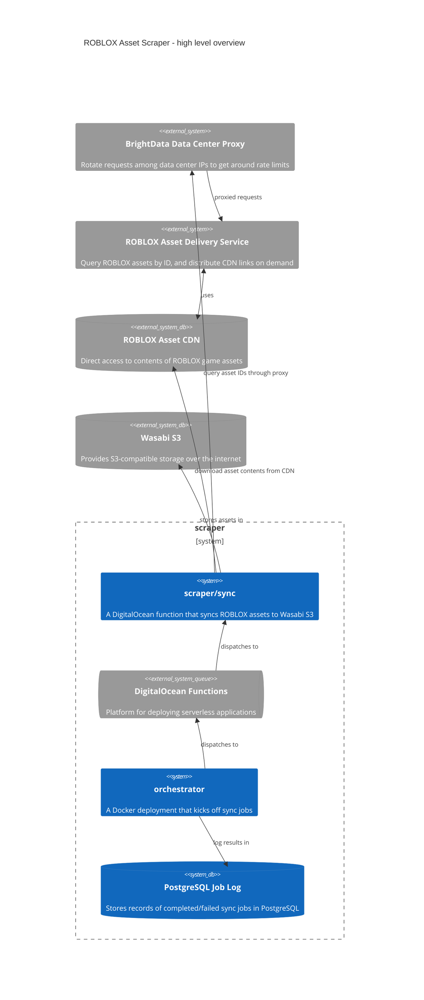

# go-rblx-asset-scraper

## Introduction

This repository contains a collection of scripts and deployments for scraping ROBLOX's public game assets. Currently about 10% of ROBLOX scripts (a small subset of the entire asset collection) have been scraped, equating to about 500 GB compressed.

ROBLOX distributes links to assets in their CDN through the Asset Delivery API. The Asset Delivery API lets you query up to 256 different ID's at a time (a bizarre restraint). Hence, if you want to scrape a sparse subset of their 10 billion assets in a reasonable amount of time, you have to make _many_ requests to the Asset Delivery API.

