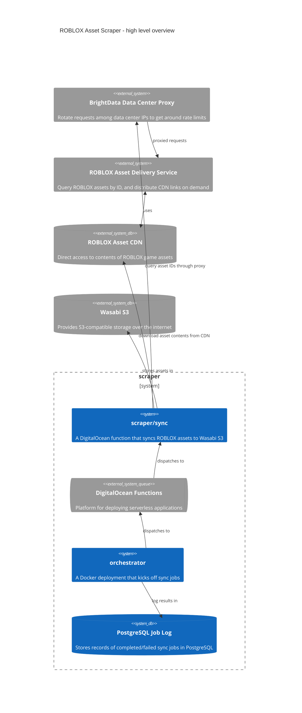

# go-rblx-asset-scraper

## Introduction

This repository contains a collection of scripts and deployments for scraping ROBLOX's public game assets. Currently about 10% of ROBLOX scripts (a small subset of the entire asset collection) have been scraped, equating to about 500 GB compressed.

ROBLOX distributes links to assets in their CDN through the Asset Delivery API. The Asset Delivery API lets you query up to 256 different ID's at a time (a bizarre restraint). Hence, if you want to scrape a sparse subset of their 10 billion assets in a reasonable amount of time, you have to make _many_ requests to the Asset Delivery API.

## JA3 Token Spoofing

It turns out web servers nowadays use something called the [JA3 token](https://github.com/salesforce/ja3) to detect probable bad actors. The JA3 token is derived from the TLS handshake, a sequence of communications at the beginning of a TLS session. The presence of certain ciphers, specs, and versions is translated into a "fingerprint" that can be commonly associated with popular browsers, as each browser has their own specific TLS configuration.

Using [`utls`](https://github.com/refraction-networking/utls) to manipulate our TLS behavior we were able to 4x our throughput of requests... for a brief period of time. Eventually the rate limits seemed to tighten more as I kept running the project. It's hard to say what caused that, but in the end it didn't work as well as I had hoped.

## Retro

Using DigitalOcean functions was probably not worth it. Initially the idea was to scale up the service massively on DigitalOcean's platform, but rate limits from both DigitalOcean and ROBLOX hit us hard. The combined costs of memory usage in DigitalOcean Functions and for datacenter proxy IPs was hundreds of dollars, which, while cheap in some contexts, was more than I wanted to spend on this project.

Also, repeatedly seeing the application work for 12 hours to suddenly start getting rate limited was frustrating. I had to research techniques like JA3 spoofing, and continually spend more money on a larger pool of proxy IPs, until I gave up about 10% of the way through. I feel for the poor engineer that had to fend off my requests.
