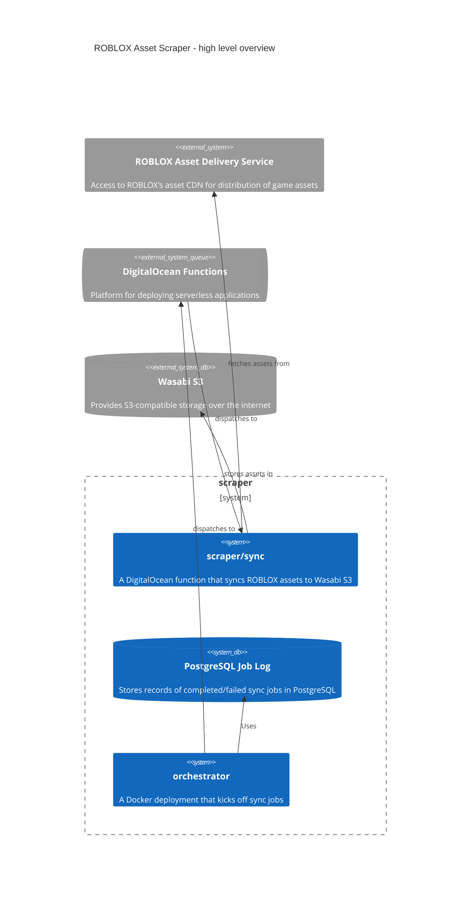

# go-rblx-asset-scraper

## Introduction

This repository contains a collection of scripts and deployments for scraping ROBLOX's public game assets.

```mermaid
C4Context
  title ROBLOX Asset Scraper - high level overview
  Boundary(scraper, "scraper") {
    System(sync, "scraper/sync", "A DigitalOcean function that syncs ROBLOX assets to Wasabi S3")
    SystemDb(postgres, "PostgreSQL Job Log", "Stores records of completed/failed sync jobs in PostgreSQL")
    System(orchestrator, "orchestrator", "A Docker deployment that kicks off sync jobs")
    Rel(orchestrator, postgres, "Uses")
  }
  System_Ext(rblx, "ROBLOX Asset Delivery Service", "Access to ROBLOX's asset CDN for distribution of game assets")
  SystemQueue_Ext(do, "DigitalOcean Functions", "Platform for deploying serverless applications")
  SystemDb_Ext(s3, "Wasabi S3", "Provides S3-compatible storage over the internet")

  Rel(orchestrator, do, "dispatches to")
  Rel(do, sync, "dispatches to")
  Rel(sync, rblx, "fetches assets from")
  Rel(sync, s3, "stores assets in")
```
